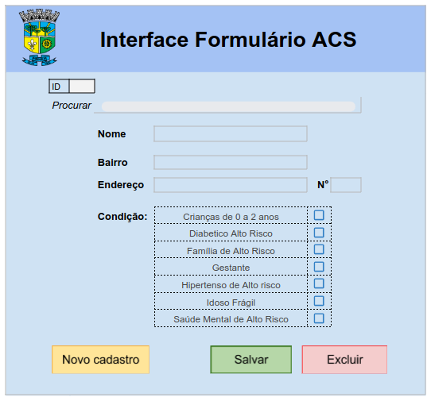

# Projeto de Apoio aos Agentes Comunitários de Saúde - Pinhais, Paraná

Este projeto visa facilitar o trabalho dos Agentes Comunitários de Saúde da cidade de Pinhais, Paraná, proporcionando uma interface intuitiva para gerenciar dados de cadastro, atualização e exclusão de pacientes. Os dados são armazenados em uma planilha online do Google Sheets, que é transformada em um formulário visualmente amigável por meio de Google Apps Script.

## Funcionalidades

- **Cadastro de Pacientes:** Adicione novos pacientes com informações como nome, endereço e condição de saúde.
- **Atualização de Cadastros:** Edite informações existentes para manter os dados atualizados.
- **Exclusão de Cadastros:** Remova pacientes da lista quando necessário.

## Condições de Saúde

Os pacientes podem ser categorizados em uma das seguintes condições de saúde:

- Crianças de 0 a 2 anos
- Diabético de Alto Risco
- Família de Alto Risco
- Gestante
- Hipertenso de Alto Risco
- Idoso Frágil
- Saúde Mental de Alto Risco

## Estrutura do Projeto

- **Interface:** Contém a interface para adicionar, editar ou remover dados.
- **Settings:** Configurações do projeto, como ID da planilha.
- **DATA:** Armazena os dados coletados dos pacientes.

## Como Funciona

1. Abra a aba `Interface` na planilha para acessar a interface do usuário.
2. Adicione, edite ou remova pacientes conforme necessário.
3. Os dados serão automaticamente atualizados na aba `DATA`.
4. Utilize os dados para criar mapas e visualizações relevantes.

## Requisitos

- Navegador da Web para acessar a planilha online do Google Sheets.

## Contribuição

Sinta-se à vontade para contribuir com melhorias ou correções para este projeto.

